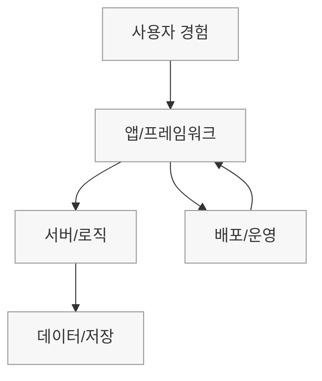
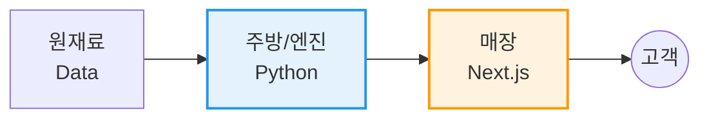
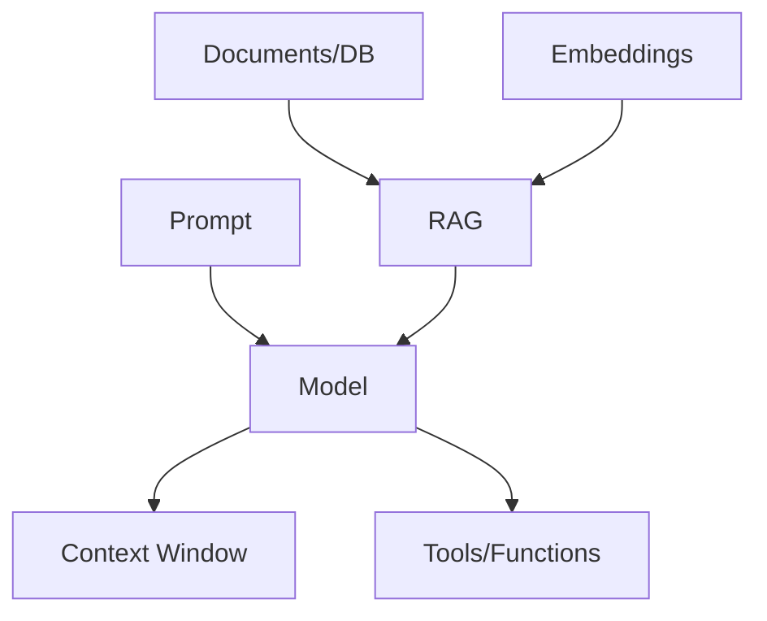

# 비개발자를 위한<br/>IT 개념 지도 🚀

<div class="text-center text-gray-500 text-base mt-6">
  복잡한 개발 용어를 <span class="text-blue-600 font-bold">업무 흐름</span>으로 번역합니다
</div>

<v-motion
  :initial="{ opacity: 0, y: 10 }"
  :enter="{ opacity: 1, y: 0, transition: { delay: 200 } }"
  class="mt-16 flex justify-center gap-8"
>
  <div class="text-center">
    <div class="text-3xl mb-1">🧠</div>
    <div class="text-xs font-bold">뇌 (Logic)</div>
  </div>

  <div class="text-gray-300 text-2xl">➜</div>

  <div class="text-center">
    <div class="text-3xl mb-1">🖼️</div>
    <div class="text-xs font-bold">얼굴 (UI)</div>
  </div>

  <div class="text-gray-300 text-2xl">➜</div>

  <div class="text-center">
    <div class="text-3xl mb-1">🚚</div>
    <div class="text-xs font-bold">배송 (Deploy)</div>
  </div>
</v-motion>

---
layout: two-cols
---

# 🧭 용어 지도

<div class="h-80 mt-4">



</div>

::right::

<div class="ml-4 mt-16">
  <div class="p-4 rounded-lg bg-blue-50 border-l-4 border-blue-500 mb-4" v-motion-slide-visible-right>
    <div class="font-bold text-sm mb-2">✅ 핵심 메시지</div>
    <div class="text-xs text-gray-700">
      화면(Frontend)과 로직·데이터(Backend) 위에<br/>
      <b>배포·운영(Delivery)</b>이 올라가야 서비스가 됩니다.
    </div>
  </div>

  <div class="p-4 rounded-lg bg-orange-50 border-l-4 border-orange-500" v-motion-slide-visible-right>
    <div class="font-bold text-sm mb-2">⚠️ 흔한 오해</div>
    <div class="text-xs text-gray-700">
      코드를 짜도 <b>배포</b>가 안 되면 아무도 못 씁니다.<br/>
      배포 후에도 <b>운영</b>이 필요합니다.
    </div>
  </div>
</div>

---
layout: default
---

# 🧭 한눈에 보는 서비스 구조도

개발은 **"데이터를 가공해서 고객에게 서빙하는 과정"**입니다.

<div class="h-56">



</div>

<div class="grid grid-cols-2 gap-6 mt-6">
  <div class="p-3 border-l-4 border-blue-500 bg-gray-50 rounded text-sm" v-motion-slide-visible-left>
    <h3 class="font-bold text-blue-700">Backend (보이지 않는 영역)</h3>
    <p class="text-xs text-gray-600 mt-1">계산·저장·규칙·자동화</p>
  </div>

  <div class="p-3 border-l-4 border-orange-500 bg-gray-50 rounded text-sm" v-motion-slide-visible-right>
    <h3 class="font-bold text-orange-700">Frontend (보이는 영역)</h3>
    <p class="text-xs text-gray-600 mt-1">사용자가 클릭하고 보는 경험</p>
  </div>
</div>

---
layout: two-cols
---

# 1) 🧠 뇌와 엔진

## Python & ETL

**생각(로직)**과 **재료(데이터)**가 없으면 껍데기입니다.

<v-clicks>

<div class="mb-4">
🐍 <b>Python</b><br/>
<span class="text-xs text-gray-600">
업무 규칙·계산·자동화를 실행하는 두뇌
</span>
</div>

<div class="mb-4">
⚙️ <b>ETL</b><br/>
<span class="text-xs text-gray-600">
날것을 쓸 수 있는 형태로 가공
</span>
</div>

<div class="mb-4">
🗄️ <b>DB/Storage</b><br/>
<span class="text-xs text-gray-600">
결과를 보관하는 창고
</span>
</div>

</v-clicks>

::right::

<div class="ml-4 mt-8">
  <div v-motion
    :initial="{ opacity: 0, y: 10 }"
    :enter="{ opacity: 1, y: 0, transition: { delay: 150 } }"
    class="p-4 bg-gray-100 dark:bg-gray-800 rounded-lg"
  >
    <h3 class="text-base font-bold mb-2">💡 비유로 정리</h3>
    <ul class="space-y-2 text-xs">
      <li class="flex items-start">
        <span class="mr-2">👨‍🍳</span>
        <span><b>Python</b> = 주방장</span>
      </li>
      <li class="flex items-start">
        <span class="mr-2">🥬</span>
        <span><b>ETL</b> = 손질 담당</span>
      </li>
      <li class="flex items-start">
        <span class="mr-2">📦</span>
        <span><b>DB</b> = 창고</span>
      </li>
    </ul>
  </div>
</div>

---
layout: default
---

# 🧪 ETL vs ELT

현장에서는 "ETL"이라고 통칭하지만, 요즘은 "ELT"도 자주 나옵니다.

<div class="grid grid-cols-2 gap-8 mt-8">
  <div v-motion-slide-visible-left>
    <h3 class="font-bold mb-2">ETL</h3>
    <div class="text-xs text-gray-600 mb-4">"손질 먼저 → 저장"</div>
    <div class="text-xs">
      Extract → Transform → Load<br/>
      가공이 무거울 때 사용
    </div>
  </div>

  <div v-motion-slide-visible-right>
    <h3 class="font-bold mb-2">ELT</h3>
    <div class="text-xs text-gray-600 mb-4">"저장 먼저 → 필요할 때 가공"</div>
    <div class="text-xs">
      Extract → Load → Transform<br/>
      데이터웨어하우스가 강할 때
    </div>
  </div>
</div>

---
layout: two-cols
---

# 2) 🖼️ 인테리어와 접객

## React & Next.js

<v-clicks>

<div class="mb-4">
⚛️ <b>React</b><br/>
<span class="text-xs text-gray-600">
화면을 이루는 재사용 가능한 부품
</span>
</div>

<div class="mb-4">
🚀 <b>Next.js</b><br/>
<span class="text-xs text-gray-600">
페이지·속도·검색까지 갖춘 프레임워크
</span>
</div>

<div class="mb-4">
🧭 <b>Routing</b><br/>
<span class="text-xs text-gray-600">
페이지 경로 설계
</span>
</div>

</v-clicks>

::right::

<div class="ml-4 mt-6">
  <div class="text-center mb-6" v-motion-slide-visible-right>
    <div class="text-5xl mb-2">🧱</div>
    <div class="text-sm font-bold mb-1">React</div>
    <div class="text-xs text-gray-500">레고 블록</div>
  </div>

  <div class="text-center text-2xl mb-6">⬇️</div>

  <div class="text-center" v-motion-slide-visible-right>
    <div class="text-5xl mb-2">🏢</div>
    <div class="text-sm font-bold mb-1">Next.js</div>
    <div class="text-xs text-gray-500">완성된 건물</div>
    <div class="text-xs text-gray-400 mt-2">
      (구조 + 배관 + 전기)
    </div>
  </div>
</div>

---
layout: default
---

# ⚛️ React vs 🚀 Next.js

"둘 다 프론트 같은데 뭐가 다르지?"

<div class="grid grid-cols-2 gap-6 mt-12">
  <div class="p-4 rounded bg-gray-50 border" v-motion-slide-visible-left>
    <div class="font-bold mb-2">React</div>
    <div class="text-sm text-gray-600">
      "화면 부품을 만드는 도구"<br/>
      버튼/카드/입력창 등 컴포넌트 중심
    </div>
  </div>

  <div class="p-4 rounded bg-gray-50 border" v-motion-slide-visible-right>
    <div class="font-bold mb-2">Next.js</div>
    <div class="text-sm text-gray-600">
      "서비스가 굴러가게 하는 뼈대"<br/>
      페이지/성능/배포까지 포함한 앱 구조
    </div>
  </div>
</div>

---
layout: default
---

# 3) ✅ 품질 관리 & 오픈

만들었다고 끝이 아닙니다. **검증**하고 **배포**해야 서비스가 됩니다.

<div class="grid grid-cols-2 gap-6 mt-8">
  <div class="bg-white dark:bg-gray-800 border-t-4 border-red-500 p-4 shadow rounded-b"
    v-motion :initial="{ y: 10, opacity: 0 }" :enter="{ y: 0, opacity: 1, transition: { delay: 100 } }">
    <h3 class="font-bold mb-2">🛡️ Test</h3>
    <div class="space-y-1 text-xs">
      <div class="flex justify-between border-b pb-1">
        <span>ESLint</span><span class="text-gray-400">규칙 검사</span>
      </div>
      <div class="flex justify-between border-b pb-1">
        <span>Unit</span><span class="text-gray-400">함수 단위</span>
      </div>
      <div class="flex justify-between border-b pb-1">
        <span>E2E</span><span class="text-gray-400">사용 흐름</span>
      </div>
    </div>
  </div>

  <div class="bg-white dark:bg-gray-800 border-t-4 border-green-500 p-4 shadow rounded-b"
    v-motion :initial="{ y: 10, opacity: 0 }" :enter="{ y: 0, opacity: 1, transition: { delay: 220 } }">
    <h3 class="font-bold mb-2">🚀 Deploy</h3>
    <div class="space-y-1 text-xs">
      <div class="flex justify-between border-b pb-1">
        <span>Vercel</span><span class="text-gray-400">호스팅</span>
      </div>
      <div class="flex justify-between border-b pb-1">
        <span>CI/CD</span><span class="text-gray-400">자동화</span>
      </div>
      <div class="flex justify-between border-b pb-1">
        <span>Git</span><span class="text-gray-400">이력/협업</span>
      </div>
    </div>
  </div>
</div>

---
layout: default
---

# 🚚 Deploy vs Release vs Ops

"올렸는데 왜 안 보이지?"는 보통 여기서 발생합니다.

<div class="grid grid-cols-3 gap-3 mt-12">
  <div class="p-4 rounded bg-gray-50 border text-sm" v-motion-slide-visible-left>
    <div class="font-bold mb-1">Deploy</div>
    <div class="text-xs text-gray-600">서버에 올린다</div>
  </div>

  <div class="p-4 rounded bg-gray-50 border text-sm" v-motion-slide-visible-up>
    <div class="font-bold mb-1">Release</div>
    <div class="text-xs text-gray-600">고객에게 켠다</div>
  </div>

  <div class="p-4 rounded bg-gray-50 border text-sm" v-motion-slide-visible-right>
    <div class="font-bold mb-1">Ops</div>
    <div class="text-xs text-gray-600">살아있게 유지</div>
  </div>
</div>

---
layout: section
---

# 🚧 실전 생존 키트

바이브 코딩을 시작하면 마주치는 현실

---
layout: default
---

# 4) 🔐 환경 변수 (.env)

"비밀번호는 코드에 쓰지 않습니다."

<div class="grid grid-cols-2 gap-6 mt-6">
  <div v-motion-slide-visible-left class="text-sm">
    <h3 class="font-bold mb-2">왜 필요한가?</h3>
    <p class="text-xs text-gray-600 leading-relaxed">
      API Key 같은 비밀값을 코드에 적으면 노출 위험이 큽니다.<br/>
      값은 <b>환경에서 주입</b>받고, 코드는 "이름"만 알게 합니다.
    </p>
  </div>

  <div v-motion-slide-visible-right class="text-sm">
    <h3 class="font-bold mb-2">사용 예시</h3>

```javascript
// Node.js
const key = process.env.API_KEY
```

```python
# Python
import os
key = os.getenv("API_KEY")
```
  </div>
</div>

---
layout: default
---

# 🛒 의존성 (Dependencies)

"서버는 빈 냉장고로 시작합니다."

<div class="grid grid-cols-2 gap-6 mt-6">
  <div v-motion-slide-visible-left class="text-sm">
    <h3 class="font-bold mb-2">왜 필요한가?</h3>
    <p class="text-xs text-gray-600 leading-relaxed">
      내 PC에 있던 라이브러리가 서버에는 없습니다.<br/>
      배포할 때 "이 재료를 설치해줘"라는 목록이 필요합니다.
    </p>
  </div>

  <div v-motion-slide-visible-right class="text-sm">
    <h3 class="font-bold mb-2">목록 예시</h3>

```txt
# Python
pandas==2.2.0
openai==1.0.0
```

```json
// Node
{ "dependencies": {
  "next": "14.x"
}}
```
  </div>
</div>

---
layout: default
---

# 🧷 Dependency 3종 세트

"내 컴퓨터에서는 되는데…"를 줄이는 장치

| 구성 | 예시 | 의미 |
|---|---|---|
| 패키지 목록 | package.json | "뭘 설치할지" |
| 버전 | 1.2.3 | "호환성 규칙" |
| 락파일 | package-lock.json | "정확히 이 조합으로" |

<div class="mt-8 text-sm text-gray-600" v-motion-slide-visible-up>
  락파일이 없으면 같은 목록이어도 "세부 버전"이 달라져서,
  배포 환경에서만 깨지는 일이 생깁니다.
</div>

---
layout: two-cols
---

# 5) 환경의 종류

## Local / Staging / Production

"제 컴퓨터에서는 되는데요?"

<v-clicks>

<div class="mt-4 text-sm">
🏠 <b>Local</b><br/>
<span class="text-xs text-gray-600">
내 PC에서 실험 (나만 봄)
</span>
</div>

<div class="mt-4 text-sm">
🧪 <b>Staging</b><br/>
<span class="text-xs text-gray-600">
리허설 환경 (팀이 검증)
</span>
</div>

<div class="mt-4 text-sm">
🌏 <b>Production</b><br/>
<span class="text-xs text-gray-600">
고객이 쓰는 운영 환경
</span>
</div>

</v-clicks>

::right::

<div class="ml-4 mt-8 text-center">
  <div v-motion
    :initial="{ scale: 0.92, opacity: 0 }"
    :enter="{ scale: 1, opacity: 1, transition: { delay: 180 } }"
  >
    <div class="text-5xl mb-3">🚧</div>
    <div class="p-3 bg-yellow-100 text-yellow-800 rounded text-xs font-bold">
      Pro Tip<br/>
      "배포해보기 전까진<br/>완성된 게 아닙니다."
    </div>
  </div>
</div>

---
layout: default
---

# 🚧 배포에서만 터지는 3대 용어

<div class="grid grid-cols-3 gap-3 mt-10">
  <div class="p-3 rounded bg-gray-50 border text-sm" v-motion-slide-visible-left>
    <div class="font-bold mb-1">CORS</div>
    <div class="text-xs text-gray-600">
      브라우저가 "다른 출처 요청"을 막는 규칙
    </div>
  </div>

  <div class="p-3 rounded bg-gray-50 border text-sm" v-motion-slide-visible-up>
    <div class="font-bold mb-1">Build-time</div>
    <div class="text-xs text-gray-600">
      빌드 순간에 값이 확정되는 영역
    </div>
  </div>

  <div class="p-3 rounded bg-gray-50 border text-sm" v-motion-slide-visible-right>
    <div class="font-bold mb-1">Runtime</div>
    <div class="text-xs text-gray-600">
      서버가 도는 순간에 읽는 값
    </div>
  </div>
</div>

---
layout: center
class: text-center
---

# 6) 🧠 AI의 기억력

"AI도 대화가 길어지면 흐릿해집니다."

<div class="flex justify-center items-center gap-8 mt-8">
  <div class="w-52 p-4 bg-gray-100 rounded opacity-60 text-sm">
    <div class="text-3xl mb-1">😵‍💫</div>
    <div class="font-bold mb-1">긴 대화</div>
    <div class="text-xs text-gray-600">
      조건을 놓치거나<br/>코드를 대충 붙이기도
    </div>
  </div>

  <div class="text-xl font-bold text-blue-500">VS</div>

  <div class="w-52 p-4 border-2 border-blue-500 bg-blue-50 rounded shadow text-sm"
    v-motion :initial="{ scale: 0.95, opacity: 0 }" :enter="{ scale: 1, opacity: 1, transition: { delay: 180 } }">
    <div class="text-3xl mb-1">✨</div>
    <div class="font-bold text-blue-700 mb-1">새 채팅</div>
    <div class="text-xs text-gray-700">
      작게 쪼개고<br/>핵심만 전달
    </div>
  </div>
</div>

---
layout: default
---

# 🧠 AI 용어도 "구조"로 보면 쉽다

<div class="h-56 mt-4 scale-90">



</div>

<div class="text-xs text-gray-600 text-center mt-2" v-motion-slide-visible-up>
  <b>RAG</b>는 필요한 자료를 <b>찾아서 붙여주는</b> 방식
</div>

---
layout: default
---

# 🧩 용어 10초 분류표

현장에서 제일 자주 섞이는 단어만 정리

<div class="text-xs">

| 용어 | 비슷한 말 | 핵심 차이 | 흔한 착각 |
|---|---|---|---|
| Library | 패키지 | "부품" (내가 골라 씀) | 라이브러리=앱 전체 |
| Framework | 플랫폼 | "뼈대" (흐름을 정함) | 프레임워크=모음 |
| Runtime | 실행 환경 | "코드가 도는 판" | 어디서나 동일 |
| Deploy | Release | 서버에 올림 | 배포=공개 |
| API | Endpoint | 시스템 간 대화 규격 | API=라이브러리 |

</div>

---
layout: center
class: text-center
---

# 🎓 3줄 요약

<div class="max-w-xl mx-auto mt-6 text-left space-y-3">
  <div v-motion-slide-visible-up class="flex items-center p-3 bg-gray-50 rounded text-sm">
    <div class="text-2xl mr-3">🧠</div>
    <div>
      <div class="font-bold">Python은 "지능"</div>
      <div class="text-xs text-gray-500">규칙과 계산으로 결과를 만든다</div>
    </div>
  </div>

  <div v-motion-slide-visible-up class="flex items-center p-3 bg-gray-50 rounded text-sm">
    <div class="text-2xl mr-3">🖼️</div>
    <div>
      <div class="font-bold">Next.js는 "매장"</div>
      <div class="text-xs text-gray-500">화면과 구조를 제공한다</div>
    </div>
  </div>

  <div v-motion-slide-visible-up class="flex items-center p-3 bg-gray-50 rounded text-sm">
    <div class="text-2xl mr-3">✅</div>
    <div>
      <div class="font-bold">Test & Deploy는 "신뢰"</div>
      <div class="text-xs text-gray-500">안정적으로 열고 유지한다</div>
    </div>
  </div>
</div>

---
layout: center
class: text-center
---

# 🏁 결론

<div class="text-lg leading-relaxed text-gray-700 dark:text-gray-300 max-w-2xl mx-auto">
  개발을 직접 하지 않더라도<br/>
  <span class="font-bold text-blue-600">"어디가 뇌이고, 어디가 얼굴인지"</span>만 알면<br/>
  AI에게 일을 훨씬 정확하게 시킬 수 있습니다.
  <br/><br/>
  여러분의 <b>기획력</b> 위에 이 <b>구조 감각</b>을 얹으면 됩니다.
</div>
